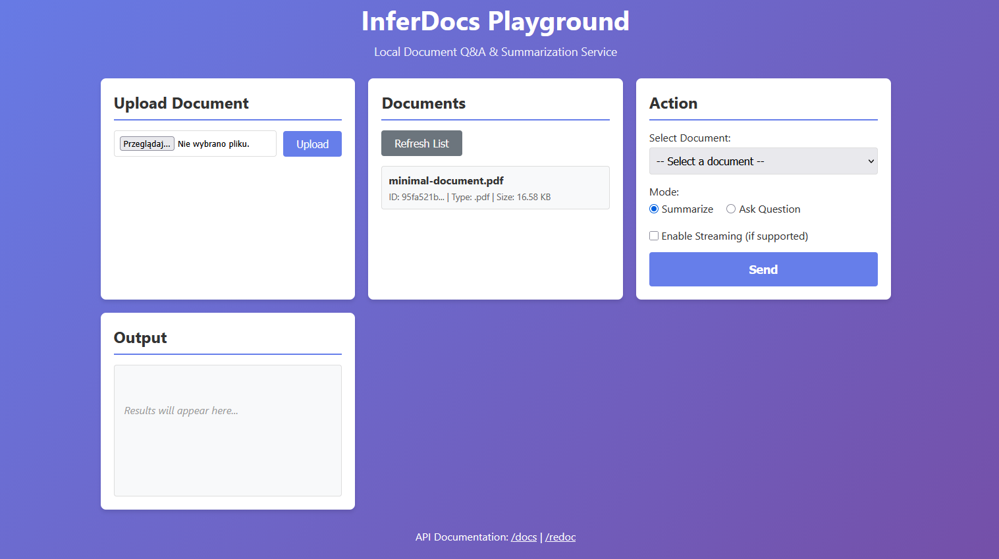
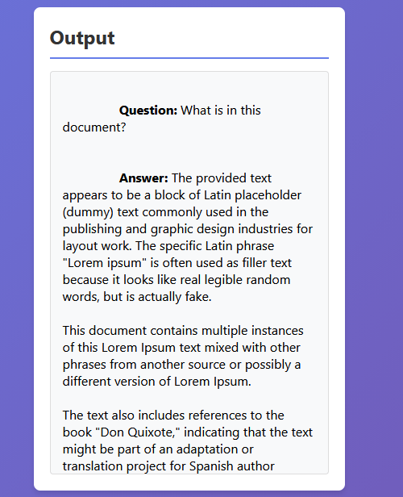
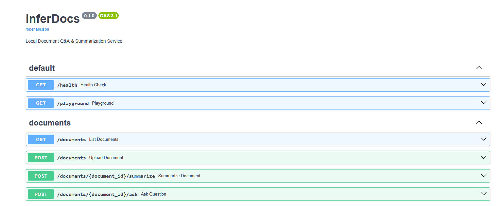
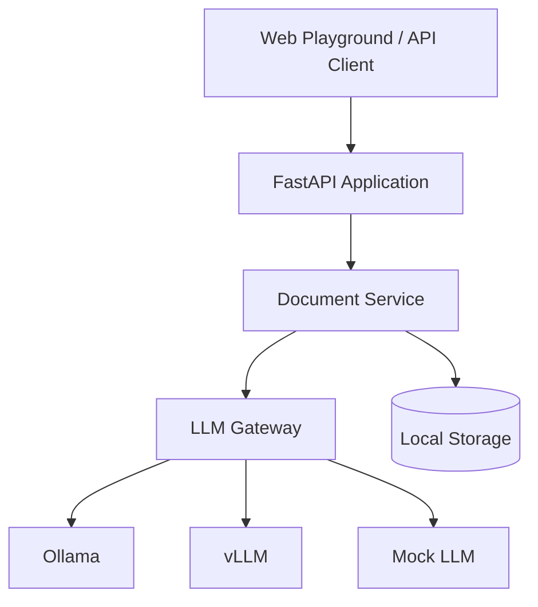

# inferdocs

Upload a document, ask questions about it, get answers. Everything runs locally — no API keys, no cloud, nothing leaves your machine.

I built this because I kept copy-pasting chunks of PDFs into ChatGPT to find specific information. There's a better way. This is a FastAPI backend that handles document ingestion, summarization, and Q&A using whatever model you have running in Ollama.

---

## Screenshots

### Web playground


### Document Q&A


### Swagger UI


---

## What it does

- Upload TXT, MD, or PDF files
- Summarize documents (brief, detailed, or custom length)
- Ask free-form questions and get answers grounded in the document content
- Swap between Ollama and vLLM backends via a single env variable
- Mock backend available if you just want to test the API without a model running

---

## Quick start

### Windows

```powershell
git clone https://github.com/kpalubicki/inferdocs.git
cd inferdocs

# Install Ollama from https://ollama.ai/ if you haven't already
ollama pull qwen2.5:3b

# If script execution is blocked:
Set-ExecutionPolicy -ExecutionPolicy RemoteSigned -Scope CurrentUser

.\scripts\run_windows.ps1
```

Open http://localhost:8000/playground

### Linux

```bash
git clone https://github.com/kpalubicki/inferdocs.git
cd inferdocs

curl -fsSL https://ollama.ai/install.sh | sh
ollama serve
ollama pull qwen2.5:3b

chmod +x scripts/run_linux.sh
./scripts/run_linux.sh
```

### Docker

```bash
# With Ollama
docker compose --profile ollama up -d

# With vLLM (needs GPU)
docker compose --profile vllm up -d
```

---

## API

### Health check
```bash
curl http://localhost:8000/health
```

```json
{
  "status": "healthy",
  "backend": "ollama",
  "model": "qwen2.5:3b",
  "version": "0.1.0"
}
```

### Upload a document
```bash
curl -X POST http://localhost:8000/documents \
  -F "file=@report.pdf"
```

```json
{
  "document_id": "abc-123",
  "filename": "report.pdf",
  "message": "Document uploaded successfully"
}
```

### Summarize
```bash
curl -X POST http://localhost:8000/documents/abc-123/summarize \
  -H "Content-Type: application/json" \
  -d '{"max_length": 100, "style": "brief"}'
```

### Ask a question
```bash
curl -X POST http://localhost:8000/documents/abc-123/ask \
  -H "Content-Type: application/json" \
  -d '{"question": "What are the main conclusions?"}'
```

Full API docs at http://localhost:8000/docs

---

## Architecture



---

## Configuration

Create a `.env` file or edit the existing one:

```bash
LLM_BACKEND=ollama    # ollama | vllm | mock
LLM_MODEL=default
APP_PORT=8000
```

The `mock` backend returns dummy responses — useful for testing the API flow without needing Ollama running.

---

## Tests

```bash
# Unit tests
pytest

# Integration tests (Ollama must be running)
pytest -m integration
```

---

## Stack

Python 3.11+, FastAPI, Pydantic v2, PyPDF, Ollama / vLLM

---

## Troubleshooting

**`running scripts is disabled on this system`**
```powershell
Set-ExecutionPolicy -ExecutionPolicy RemoteSigned -Scope CurrentUser
```

Or just skip the script and run manually:
```powershell
python -m venv venv
.\venv\Scripts\Activate.ps1
pip install -e ".[dev]"
python -m uvicorn app.main:app --reload
```

**`listen tcp 127.0.0.1:11434: bind: address already in use`**
Ollama is already running, which is fine. Skip `ollama serve` and go straight to `ollama pull`.

**Port 8000 taken**
Set `APP_PORT=8001` in `.env`.

**`requires-python >=3.11`**
You need Python 3.11+. Download from https://python.org

---

## License

MIT
