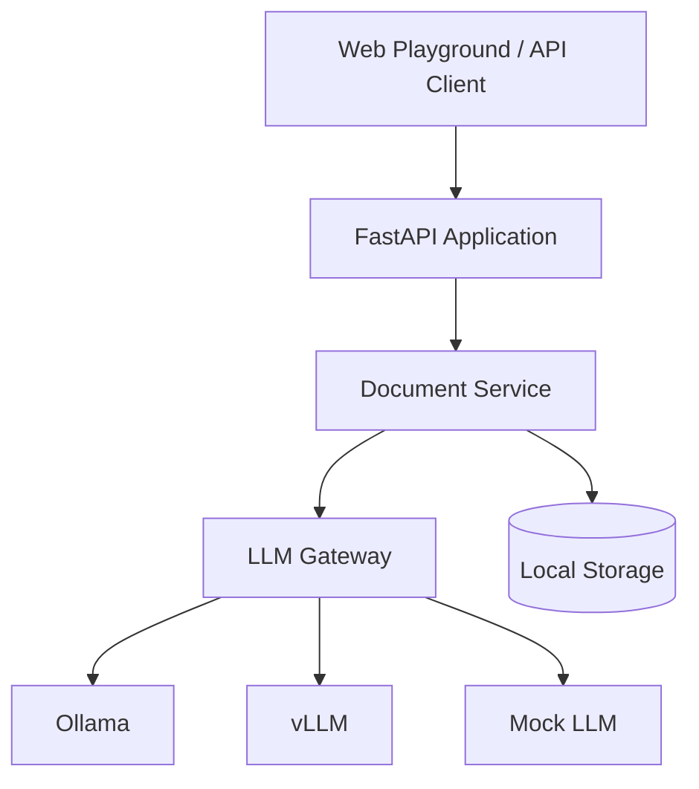

# InferDocs

Local Document Q&A & Summarization Service

## Overview

InferDocs is a local-first microservice backend built with Python and FastAPI. It enables document ingestion, summarization, and question-answering using free, local LLM models.

## Key Features

- Document upload (TXT, MD, PDF)
- AI-powered summarization
- Document Q&A
- Multiple LLM backends (Ollama, vLLM, Mock)
- Cross-platform (Windows, Ubuntu, WSL2)
- Docker optional
- Web playground included

## Architecture



## Quick Start - Windows

```powershell
# Clone repository
git clone https://github.com/kpalubicki/inferdocs.git
cd inferdocs

# Install Ollama from https://ollama.ai/
ollama serve
ollama pull qwen2.5:3b-instruct

# Run the app
.\scripts\run_windows.ps1
```

Open http://localhost:8000/playground

## Quick Start - Linux

```bash
# Clone repository
git clone https://github.com/kpalubicki/inferdocs.git
cd inferdocs

# Install Ollama
curl -fsSL https://ollama.ai/install.sh | sh
ollama serve
ollama pull qwen2.5:3b-instruct

# Run the app
chmod +x scripts/run_linux.sh
./scripts/run_linux.sh
```

## Quick Start - Docker

```bash
# With Ollama backend
docker compose --profile ollama up -d

# With vLLM backend (requires GPU)
docker compose --profile vllm up -d
```

## API Examples

### Health Check

```bash
curl http://localhost:8000/health
```

Response:
```json
{
  "status": "healthy",
  "backend": "ollama",
  "model": "qwen2.5:3b-instruct",
  "version": "0.1.0",
  "timestamp": "2025-12-25T12:00:00Z"
}
```

### Upload Document

```bash
curl -X POST http://localhost:8000/documents \
  -F "file=@sample.txt"
```

Response:
```json
{
  "document_id": "abc-123",
  "filename": "sample.txt",
  "message": "Document uploaded successfully"
}
```

### List Documents

```bash
curl http://localhost:8000/documents
```

Response:
```json
{
  "documents": [
    {
      "document_id": "abc-123",
      "filename": "sample.txt",
      "file_type": ".txt",
      "file_size": 1024,
      "upload_time": "2025-12-25T12:00:00Z"
    }
  ],
  "count": 1
}
```

### Summarize Document

```bash
curl -X POST http://localhost:8000/documents/abc-123/summarize \
  -H "Content-Type: application/json" \
  -d '{"max_length": 100, "style": "brief"}'
```

Response:
```json
{
  "document_id": "abc-123",
  "summary": "This document discusses..."
}
```

### Ask Question

```bash
curl -X POST http://localhost:8000/documents/abc-123/ask \
  -H "Content-Type: application/json" \
  -d '{"question": "What is this about?"}'
```

Response:
```json
{
  "document_id": "abc-123",
  "question": "What is this about?",
  "answer": "This document is about..."
}
```

## Documentation

- Swagger UI: http://localhost:8000/docs
- ReDoc: http://localhost:8000/redoc
- Playground: http://localhost:8000/playground

## Installation

```bash
# Install dependencies
pip install -e ".[dev]"

# Or without dev dependencies
pip install -e .
```

## Configuration

Edit `.env` file:

```bash
LLM_BACKEND=ollama    # ollama, vllm, or mock (for testing)
LLM_MODEL=default
APP_PORT=8000
```

**Note:** `mock` backend is useful for testing without requiring a real LLM.

## Testing

```bash
# Unit tests
pytest

# Integration tests (requires Ollama)
pytest -m integration
```

## Tech Stack

- Python 3.11+
- FastAPI
- Pydantic v2
- Ollama / vLLM
- PyPDF

## License

MIT License

## Links

- Repository: https://github.com/kpalubicki/inferdocs
- Issues: https://github.com/kpalubicki/inferdocs/issues
