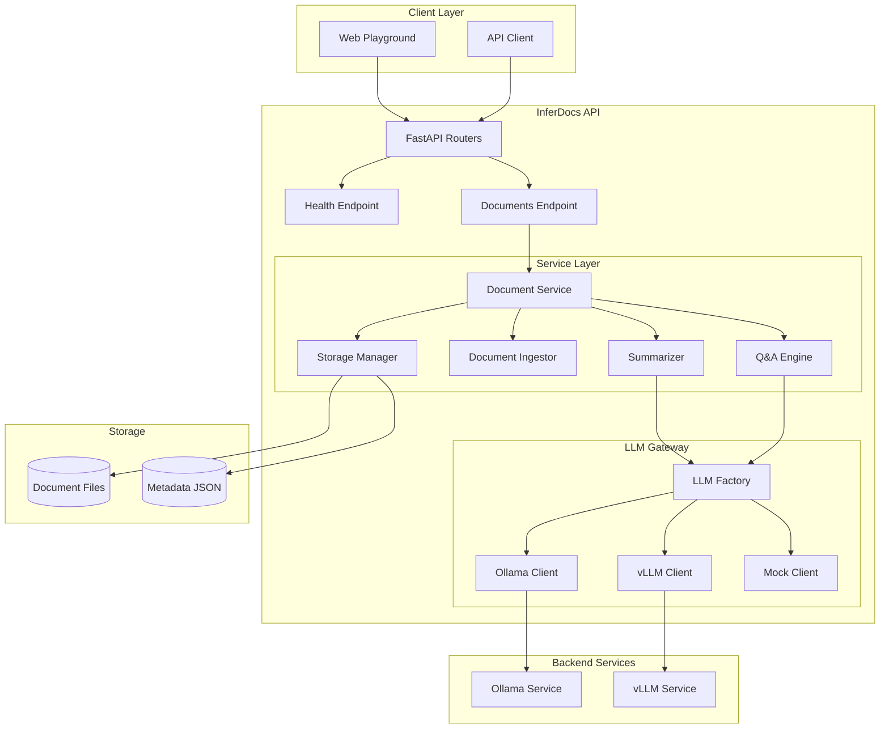

# InferDocs

**Local Document Q&A & Summarization Service**

InferDocs is a local-first microservice backend built with Python and FastAPI that enables document ingestion, summarization, and question-answering using free, local LLM models. Designed to run without Docker on Windows and Linux, with optional Docker support and GPU acceleration via vLLM.

---

## Features

- **Document Ingestion**: Upload and process TXT, MD, and PDF files
- **Document Summarization**: Generate summaries with customizable length and style
- **Document Q&A**: Ask questions about your documents and get AI-powered answers
- **Multiple LLM Backends**: Switch between Ollama, vLLM, and Mock via environment variables
- **Cross-Platform**: Works on Windows, Ubuntu, and WSL2
- **Docker Optional**: Run with or without Docker
- **Web Playground**: Browser-based UI for testing (no Node.js required)
- **Production-Ready**: Clean architecture, error handling, logging, and comprehensive tests

---

## Architecture



---

## Quickstart

### Option 1: Windows + Ollama (No Docker)

**Prerequisites:**
- Python 3.11+
- [Ollama](https://ollama.ai/) installed and running

**Steps:**

```powershell
# 1. Clone the repository
git clone https://github.com/yourusername/inferdocs.git
cd inferdocs

# 2. Start Ollama (in separate terminal)
ollama serve

# 3. Pull the default model
ollama pull qwen2.5:3b-instruct

# 4. Run the startup script
.\scripts\run_windows.ps1
```

The API will be available at:
- **Playground**: http://localhost:8000/playground
- **API Docs**: http://localhost:8000/docs
- **ReDoc**: http://localhost:8000/redoc

---

### Option 2: Ubuntu + Ollama (Bare Metal)

**Prerequisites:**
- Python 3.11+
- Ollama installed

**Steps:**

```bash
# 1. Clone the repository
git clone https://github.com/yourusername/inferdocs.git
cd inferdocs

# 2. Install Ollama (if not installed)
curl -fsSL https://ollama.ai/install.sh | sh

# 3. Start Ollama (in separate terminal)
ollama serve

# 4. Pull the default model
ollama pull qwen2.5:3b-instruct

# 5. Run the startup script
chmod +x scripts/run_linux.sh
./scripts/run_linux.sh
```

---

### Option 3: WSL2 + GPU + vLLM

**Prerequisites:**
- WSL2 with Ubuntu
- NVIDIA GPU with drivers
- Docker with GPU support

**Steps:**

```bash
# 1. Set environment for vLLM
export LLM_BACKEND=vllm

# 2. Start with Docker Compose (vLLM profile)
docker compose --profile vllm up -d

# 3. Wait for vLLM to download the model (first run)
docker compose logs -f vllm

# 4. Access the API
# Playground: http://localhost:8000/playground
```

---

### Option 4: Docker (Ollama Profile)

```bash
# Start with Ollama backend
docker compose --profile ollama up -d

# View logs
docker compose logs -f

# Stop services
docker compose --profile ollama down
```

---

### Option 5: Docker (vLLM Profile)

```bash
# Start with vLLM backend (requires GPU)
docker compose --profile vllm up -d

# View logs
docker compose logs -f

# Stop services
docker compose --profile vllm down
```

---

## Playground

Access the web playground at **http://localhost:8000/playground**

The playground allows you to:
1. Upload documents (TXT, MD, PDF)
2. View uploaded documents
3. Summarize documents
4. Ask questions about documents
5. Test streaming (if supported by backend)

No Node.js or build step required - pure HTML/CSS/JavaScript!

---

## API Documentation

### Swagger UI
Interactive API documentation: **http://localhost:8000/docs**

### ReDoc
Alternative API docs: **http://localhost:8000/redoc**

---

## Example Requests

### Health Check

```bash
curl http://localhost:8000/health
```

**Response:**
```json
{
  "status": "healthy",
  "backend": "ollama",
  "model": "qwen2.5:3b-instruct",
  "version": "0.1.0",
  "timestamp": "2025-12-25T12:00:00Z"
}
```

---

### Upload Document

```bash
curl -X POST http://localhost:8000/documents \
  -F "file=@sample.txt"
```

**Response:**
```json
{
  "document_id": "a1b2c3d4-e5f6-7890-abcd-ef1234567890",
  "filename": "sample.txt",
  "message": "Document uploaded successfully"
}
```

---

### List Documents

```bash
curl http://localhost:8000/documents
```

**Response:**
```json
{
  "documents": [
    {
      "document_id": "a1b2c3d4-e5f6-7890-abcd-ef1234567890",
      "filename": "sample.txt",
      "file_type": ".txt",
      "file_size": 1024,
      "upload_time": "2025-12-25T12:00:00Z"
    }
  ],
  "count": 1
}
```

---

### Summarize Document

```bash
curl -X POST http://localhost:8000/documents/{document_id}/summarize \
  -H "Content-Type: application/json" \
  -d '{
    "max_length": 100,
    "style": "brief"
  }'
```

**Response:**
```json
{
  "document_id": "a1b2c3d4-e5f6-7890-abcd-ef1234567890",
  "summary": "This document discusses..."
}
```

---

### Ask Question

```bash
curl -X POST http://localhost:8000/documents/{document_id}/ask \
  -H "Content-Type: application/json" \
  -d '{
    "question": "What is the main topic of this document?"
  }'
```

**Response:**
```json
{
  "document_id": "a1b2c3d4-e5f6-7890-abcd-ef1234567890",
  "question": "What is the main topic of this document?",
  "answer": "The main topic is..."
}
```

---

## Configuration

Configuration is managed via environment variables. Copy `.env.example` to `.env` and customize:

```bash
# Application Settings
APP_ENV=dev
APP_VERSION=0.1.0
APP_HOST=0.0.0.0
APP_PORT=8000

# LLM Backend: ollama | vllm | mock
LLM_BACKEND=ollama

# Model: default (auto-mapped) or specific model name
LLM_MODEL=default

# Ollama Configuration
OLLAMA_BASE_URL=http://localhost:11434

# vLLM Configuration
VLLM_BASE_URL=http://localhost:8000

# Document Storage
DOCUMENTS_DIR=./data/documents
METADATA_FILE=./data/metadata.json

# Logging
LOG_LEVEL=INFO
```

### Model Mapping

When `LLM_MODEL=default`, the following models are used:

| Backend | Model |
|---------|-------|
| ollama  | qwen2.5:3b-instruct |
| vllm    | meta-llama/Llama-3.1-8B-Instruct |
| mock    | mock-model |

---

## Testing

### Run Unit Tests (Mock Backend)

```bash
# Activate virtual environment
source venv/bin/activate  # Linux/Mac
# or
.\venv\Scripts\Activate.ps1  # Windows

# Run tests
pytest

# Run with coverage
pytest --cov=app --cov-report=html
```

### Run Integration Tests (Ollama Required)

```bash
# Ensure Ollama is running with the model
ollama pull qwen2.5:3b-instruct
ollama serve

# Run integration tests
pytest -m integration

# Or skip integration tests
pytest -m "not integration"
```

### Test Markers

- `@pytest.mark.integration` - Integration tests (require real LLM backend)
- `@pytest.mark.slow` - Slow tests (may take several seconds)

---

## Compatibility Matrix

| Platform | Docker | Bare Metal | GPU Support | Notes |
|----------|--------|------------|-------------|-------|
| Windows 10/11 | Yes | Yes | No (Ollama CPU) | Recommended: Ollama bare metal |
| Ubuntu 20.04+ | Yes | Yes | Yes (vLLM) | Full support |
| WSL2 (Ubuntu) | Yes | Yes | Yes (vLLM) | Requires NVIDIA GPU + drivers |
| macOS | Yes | Yes | No | Ollama on Apple Silicon works well |

---

## Development

### Project Structure

```
inferdocs/
 app/
    api/              # FastAPI routes and schemas
       documents.py
       health.py
       schemas.py
       errors.py
    core/             # Configuration and logging
       config.py
       logging.py
    llm/              # LLM client implementations
       base.py
       factory.py
       ollama_client.py
       vllm_client.py
       mock_client.py
    services/         # Business logic
       documents/
           storage.py
           ingest.py
           summarize.py
           qa.py
    main.py           # FastAPI application
 web/                  # Web playground
    playground.html
    playground.css
    playground.js
 tests/                # Test suite
    test_health.py
    test_documents.py
    test_summarize_mock.py
    test_qa_mock.py
    integration/
        test_summarize_ollama.py
 scripts/              # Startup scripts
    run_windows.ps1
    run_linux.sh
 docker-compose.yml    # Docker orchestration
 Dockerfile
 pyproject.toml        # Python dependencies
 README.md
```

### Code Quality

```bash
# Format code
ruff format .

# Lint code
ruff check .

# Type checking
mypy app/
```

---

## Troubleshooting

### Ollama not found

**Error:** `Ollama not detected at http://localhost:11434`

**Solution:**
1. Install Ollama from https://ollama.ai/
2. Start Ollama: `ollama serve`
3. Pull model: `ollama pull qwen2.5:3b-instruct`

### Port already in use

**Error:** `Address already in use`

**Solution:**
Change port in `.env`:
```bash
APP_PORT=8001
```

### PDF extraction fails

**Error:** `Error reading PDF file`

**Solution:**
Ensure `pypdf` is installed:
```bash
pip install pypdf
```

### vLLM requires GPU

vLLM only works with NVIDIA GPUs. For CPU-only systems, use Ollama backend.

---

## License

MIT License

Copyright (c) 2025 InferDocs Team

Permission is hereby granted, free of charge, to any person obtaining a copy
of this software and associated documentation files (the "Software"), to deal
in the Software without restriction, including without limitation the rights
to use, copy, modify, merge, publish, distribute, sublicense, and/or sell
copies of the Software, and to permit persons to whom the Software is
furnished to do so, subject to the following conditions:

The above copyright notice and this permission notice shall be included in all
copies or substantial portions of the Software.

THE SOFTWARE IS PROVIDED "AS IS", WITHOUT WARRANTY OF ANY KIND, EXPRESS OR
IMPLIED, INCLUDING BUT NOT LIMITED TO THE WARRANTIES OF MERCHANTABILITY,
FITNESS FOR A PARTICULAR PURPOSE AND NONINFRINGEMENT. IN NO EVENT SHALL THE
AUTHORS OR COPYRIGHT HOLDERS BE LIABLE FOR ANY CLAIM, DAMAGES OR OTHER
LIABILITY, WHETHER IN AN ACTION OF CONTRACT, TORT OR OTHERWISE, ARISING FROM,
OUT OF OR IN CONNECTION WITH THE SOFTWARE OR THE USE OR OTHER DEALINGS IN THE
SOFTWARE.

---

## Contributing

Contributions are welcome! Please:

1. Fork the repository
2. Create a feature branch
3. Add tests for new functionality
4. Ensure all tests pass
5. Submit a pull request

---

## Roadmap

- [ ] Support for DOCX files
- [ ] Vector database integration (ChromaDB/Qdrant)
- [ ] Multi-document Q&A
- [ ] Document clustering and search
- [ ] Streaming responses in playground
- [ ] Authentication and multi-user support
- [ ] Batch processing API

---

**Built with modern Python, FastAPI, and local-first AI principles.**
